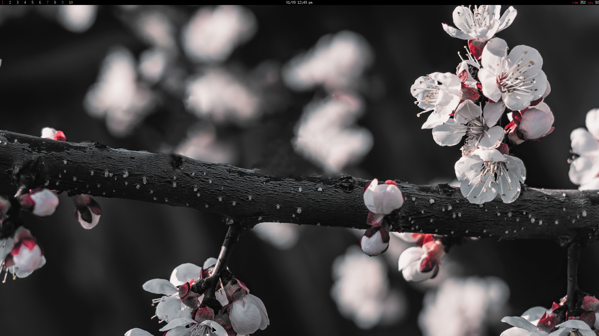

# 🌺 dotfiles

[](https://wallhaven.cc/w/gpmv73)
```
wm: dwm
launcher: dmenu
terminal: st
shell: yash
editor: neovim
notifications: herbe
```

### ✨ about ✨
my dotfiles for gentoo, managed using git and make. my intent is to keep my
dotfiles as minimal as possible and to follow the [suckless
philsophy](https://suckless.org/philosophy/). i, like the suckless developers
believe writing quality software is important and strive to set an example with
my dotfiles.

### 💿 install
```sh
git clone https://git.sr.ht/~unrealapex/dotfiles ~/dotfiles
cd ~/dotfiles
make
```

### 🗒️ notes
this rice isn't intended for use by other people, but i don't mind if you do.
for documentation's sake, this section of the readme has useful information
below about my dotfiles.

my builds of dwm, st, dmenu, herbe, and slock are stored in separate git
repositories. my makefile has a target to build them.

**extras**

additional scripts in [scripts/](/scripts).
```
$ tree scripts
  scripts
    ├── emoji_gen          generate emojis file for emoji picker
    ├── firefox            generate firefox user.js file
    ├── irssi              set up irssi scripts
    └── kill-x             bind ctrl + alt + backspace to kill x
```

window decorations should be turned off for gui apps that have the option. this
can be done in most apps by enabling the "use system titlebars" option.

skeleton files for programs that have secrets(irssi, git) are in `secrets`.

🌈 color palette
```css
* {
  --bg-color: "darkgray";
  --fg-color: "white";
  --main-color: "maroon";
}
```
